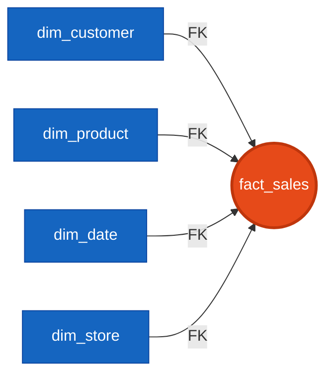

# Flow Diagram — Sales_Daily

```mermaid
graph LR
    dim_customer["dim_customer"] -->|FK| fact_sales(("fact_sales"))
    dim_product["dim_product"] -->|FK| fact_sales(("fact_sales"))
    dim_date["dim_date"] -->|FK| fact_sales(("fact_sales"))
    dim_store["dim_store"] -->|FK| fact_sales(("fact_sales"))
    style fact_sales fill:#e64a19,color:#fff,stroke:#bf360c,stroke-width:3px
    style dim_customer fill:#1565c0,color:#fff,stroke:#0d47a1,stroke-width:1px
    style dim_product fill:#1565c0,color:#fff,stroke:#0d47a1,stroke-width:1px
    style dim_date fill:#1565c0,color:#fff,stroke:#0d47a1,stroke-width:1px
    style dim_store fill:#1565c0,color:#fff,stroke:#0d47a1,stroke-width:1px
```
