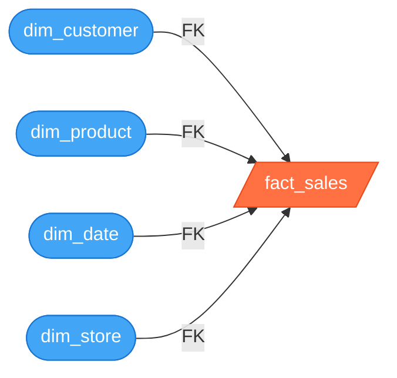

# Flow Diagram — Sales_Daily

```mermaid
graph LR
    dim_customer([dim_customer]) -->|FK| fact_sales[/fact_sales/]
    dim_product([dim_product]) -->|FK| fact_sales[/fact_sales/]
    dim_date([dim_date]) -->|FK| fact_sales[/fact_sales/]
    dim_store([dim_store]) -->|FK| fact_sales[/fact_sales/]
    style fact_sales fill:#ff7043,color:#fff,stroke:#e64a19
    style dim_customer fill:#42a5f5,color:#fff,stroke:#1976d2
    style dim_product fill:#42a5f5,color:#fff,stroke:#1976d2
    style dim_date fill:#42a5f5,color:#fff,stroke:#1976d2
    style dim_store fill:#42a5f5,color:#fff,stroke:#1976d2
```
